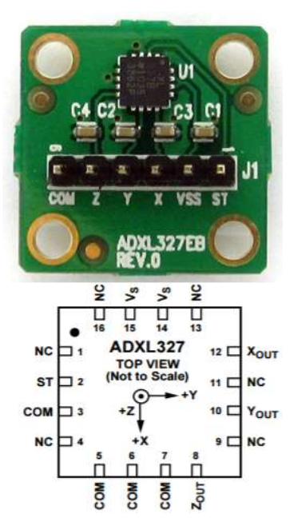

# Understanding Sensor Data

## Description
The aim here is to have a basic understanding of how to plot the sensor information for an ADXL327 3-axis accelermeter as a part of its navigational sensor suite.

*ADXL327 Accelerometer image*

A sample of the data packets streamed from the robot to the control
station has been provided “imudata.txt”. Each data packet contains the date and time of transmission along with a series of sensor readings that pertain to the robot’s navigation. The data packet provided was collected with the vehicle at rest, in an effort to calibrate the accelerometer. Here, we establish ways to read raw data for the 5th column of the file, corresponding to the pitch angle of the accelerometer as configured with the vehicle. The 5 th column begins with values [6, 3, 10, 9, 8, ...]. The x-axis of the plot should begin with 0, 1, 2, ... ; the y-axis should be in units of degrees.
