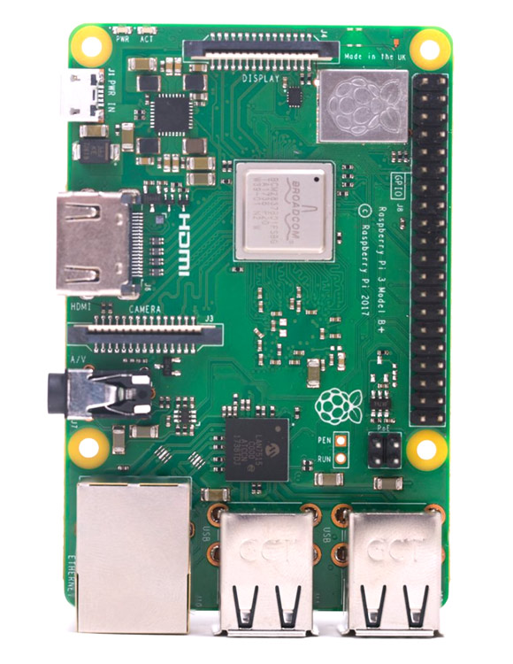
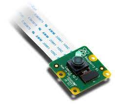

# Setting up RaspberryPi 3B+

## Description
The RaspberryPi 3B+ model is the final revision of their 3rd Gen Single Board computer

*RaspberryPi 3B+*

## Specifications and GPIO layout
- 1.4GHz 64-bit quad-core processor
- Dual band wireless LAN
- Bluetooth 4.2/BLE
- faster Ethernet
- Power-over-Ethernet support (with seperate PoE HAT)

*RaspberryPi 3B+ GPIO layout*

# Contents
- Installing packages on RPi - Numpy, OpenCV, matplotlib, imutils.
- Connecting Pi using a wireless setup to our computer. Putty into Pi.
- Use VNC to visualize RPi interface.
- Attach [RPi Camera module V2](https://www.amazon.com/Raspberry-Pi-Camera-Module-Megapixel/dp/B01ER2SKFS) and related files.
- Make sure camera works properly and is able to record images and videos.

*RaspberryPi Camera Module V2*

# Deliverable
- Final [YouTube video](https://youtu.be/2PB2nGNSFEE) to make sure the RPi can properly record videos.
