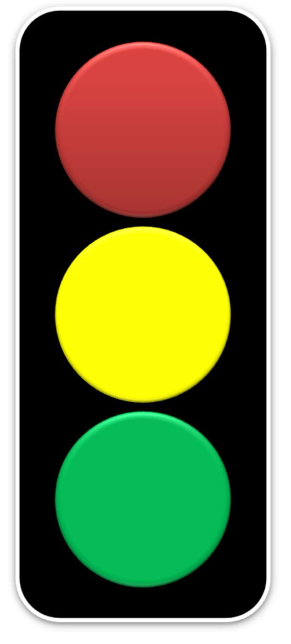

# Object identification and Tracking using RPi Camera V2

## Description
For autonomous vehicles, the perception subsystem typically consists of a camera, radar, sonar and lidar sensors. The camera senses the colors and we are going to use our mounted camera setup to visualize the presence of a traffic signal and process what light is being displayed at that particular instant. The code for this setup makes sure that we are able to detect green properly.

*Traffic light arrangement*

# Project content
- Installing packages on RPi - PiCam.
- Capture an image of yourself holding the lights and make sure the lighting is proper.
- Apply HSV masking for this image.
- Find counters and creatE a bounding circle around the moments for the pixels containing green color.
- Modify existing code to work with videos as well.
- Analysis of hardware performance.

*RaspberryPi Camera Module V2*

# Deliverable
- Final [YouTube video](https://youtu.be/2PB2nGNSFEE) to make sure the RPi can properly record videos.
