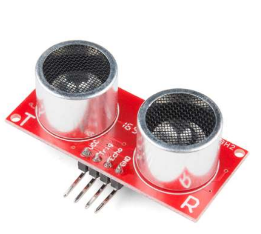

# Ranging using Ultrasonic Range Sensor and localization using arrows

## Ranging - Description
For autonomous vehicles, the perception subsystem typically consists of a camera, radar, sonar and lidar sensors. We have already discussed the role of Camera in our previous module. Now, we will discuss how to detect an obstacle ahead using an [Ultrasonic ranging sensor MAX3232](http://www.ti.com/lit/ds/symlink/max3232.pdf).

*Ultrasonic Range sensor MAX3232- Texas Instruments*

 Please refer the datasheet for choosing resistors and connections 

# Pipeline
- Installing packages on RPi - PiCam.
- Record still image using picamera.
- Use MAX3232 to record 10 successive distance measurements between Pi and the object.
- Find counters and create a bounding circle around the moments for the pixels containing green color.
- Modify existing code to work with videos as well.
- Analysis of hardware performance.

*Resultant image with identified green section.*

# Deliverable
- Final [YouTube video](https://youtu.be/veo4b-LWQBQ) to ensure RPi can properly track green color. We will further explore this in our later projects.
