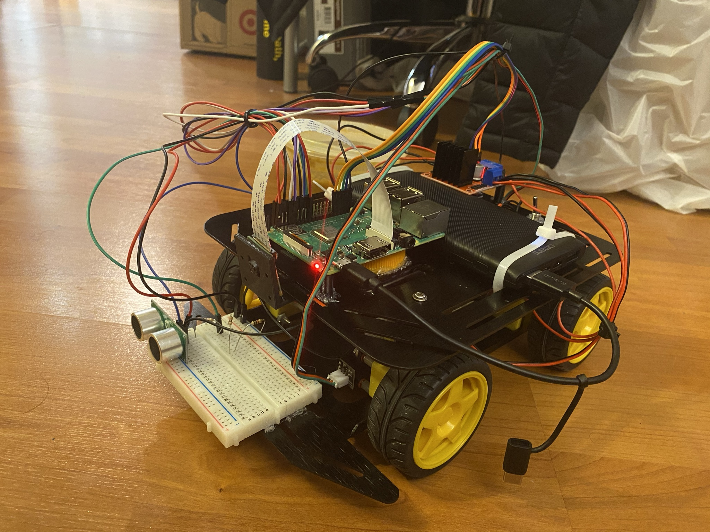
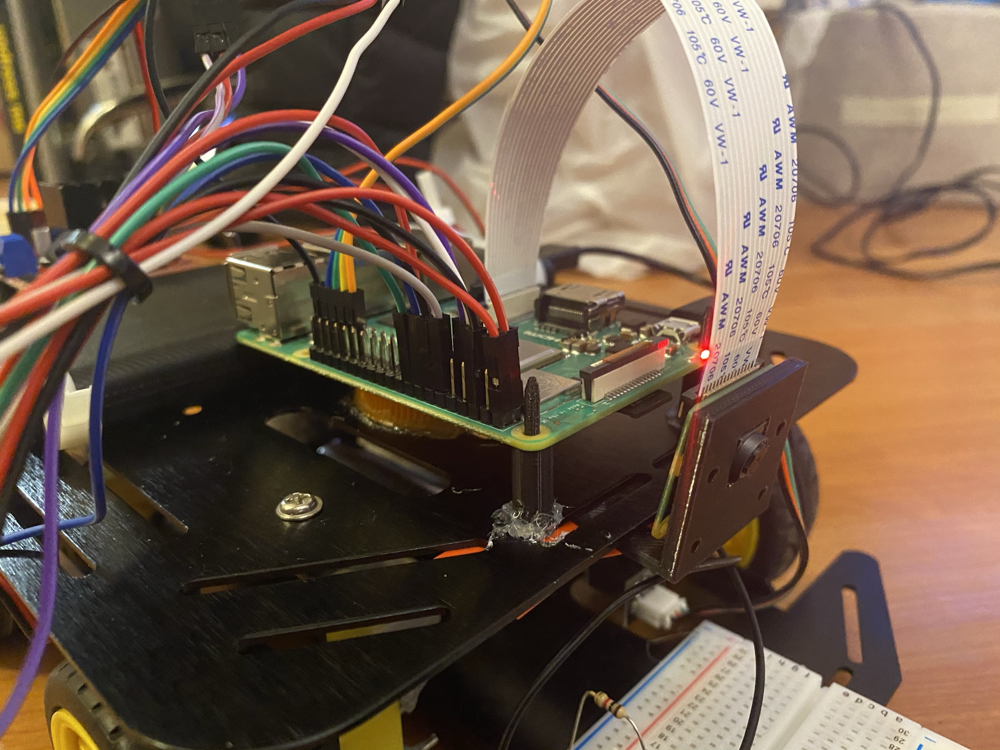

# Assembling Cap'n Kunkka - vaccine delivery robot and testing its electrical and mechanical capabilities

## Describing Cap'n Kunkka
The primary focus of this module is to assemble the robot ground up. We are using the Baron 4WD robot as our base mobile platform and are mounting our sensors on top of it. A general [time lapse video](https://youtu.be/UH9t-hU0xpg) is as attached here. We are mounting the wheels, optical encoders, RaspberryPi and camera setup, Ultrasonic sensor, motor driver and the connections to the RaspberryPi were done using dupont wires.

*Captain Kunkka - pending full assembly. (missing his gripper and IMU)*

## Components used:
- 1x [Baron 4WD Arduino Compatible robot platform w/ encoders](https://www.robotshop.com/en/dfrobot-4wd-arduino-platform-encoders.html?utm_source=google&utm_medium=surfaces&utm_campaign=surfaces_across_google_usen&gclid=CjwKCAjw_NX7BRA1EiwA2dpg0tB3INHXEuIw4m0F4IL5-xNskpYiofWkfy6RqS66eA5lRMDNr84NzxoCpCYQAvD_BwE)
- 1x [RaspberryPi 3B+](https://www.adafruit.com/product/3775)
- 1x [RaspberryPi Camera Board v2](https://www.adafruit.com/product/3099)
- 1x [16GB Card with NOOBS 3.1 for RaspberryPi Computers including 4](https://www.adafruit.com/product/4266)
- 1x [Ultrasonic distance sensor](https://www.adafruit.com/product/4007)
- 1x [9-DOF IMU](https://www.adafruit.com/product/2472)
- 1x [Micro B USB to USB C Adapter](https://www.adafruit.com/product/4299)
- 1x [H-Bridge L298D Motor driver](https://www.amazon.com/gp/product/B07C4B3DL4)
- 1x [Power Bank 10000mAh USB C Battery Pack](https://www.amazon.com/gp/product/B07G26S5V8)
- 1x [12 inch Male to Female Dupont wire](https://www.amazon.com/gp/product/B06XRV92ZB)
- 1x [Kill switch](https://www.adafruit.com/product/1995)

# Pipeline
- Assemble the mechanical and electrical components as can be seen from the previous video.
- Test the motorcontrol python file for making sure that the robot responds for teleoperation.

*Captain Kunkka mounted*

# Deliverable
- Final [YouTube video](https://youtu.be/0nTQCJZbLUA) to ensure The robot can teleoperate according to our commands. We will further explore this in our later projects.
