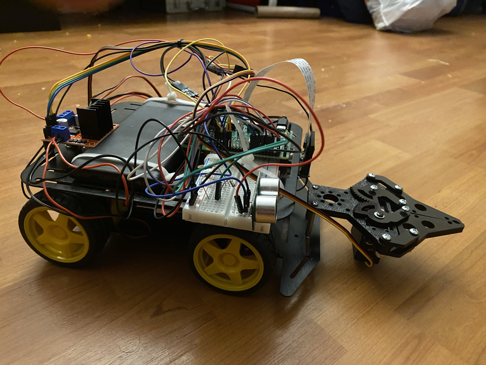
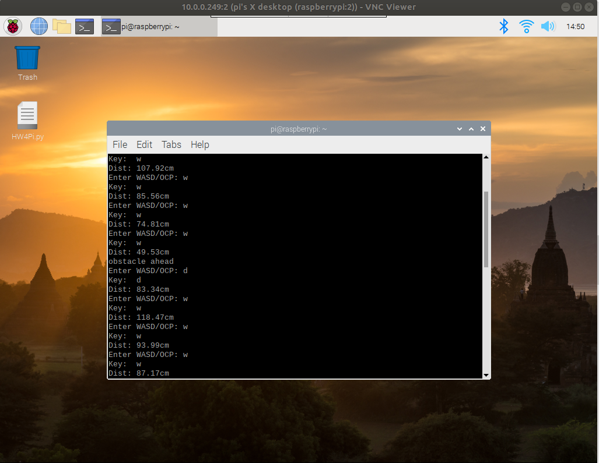

# Assembling Cap'n Kunkka's Gripper and testing

## Describing Gripper
The gripper is controlled by an electric servo motor. The gripper is used to grab the vaccines and deposit at the goal region. The duty cycle for the servo motor is controlled to make sure we can reach the goal open and close positions for the mechanical gripper.

*Captain Kunkka with his gripper*

## Components used:
- 1x [Parallel gripper setup](https://www.servocity.com/parallel-gripper-kit-a)
- 1x [Hitec 31311SHS-311 Servo Standard Universal](https://www.amazon.com/gp/product/B0006O3WVE/ref=ppx_yo_dt_b_asin_title_o00_s00?ie=UTF8&psc=1)

# Pipeline
- Assemble the mechanical and electrical components for the gripper.
- Make sure the gripper is able to move freely. The screws should not be too tight and allow for easier actuation.
- The servocontrol python files need to be tested out to make sure that gripper is functioning.
- Feel free to modify duty cycles according to your servo motor.
- Incorporate distance measurement capability in the same program (servomotor2.py).
## File servocontrol01.py description:
- Set pin 36 as output. Servo motors use a 50 Hz control signal. Slowly open and close by changing Duty cycle.
- Record images using Pi cam.
- Print Duty cycle on top of the image.
- Stitch into a [video](https://youtu.be/DgSLZYjPvfQ).

*Distances Measurement with open and close gripper.*

# Deliverable
- Final [YouTube video](https://youtu.be/OP2gd3kXTq8) to ensure The robot's gripper can open and close and pick objects according to our commands. We will further explore this in our later projects.
